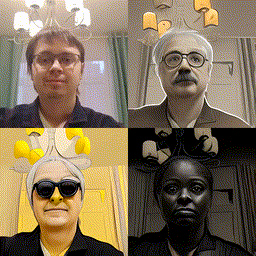

# Сборник полезных ноутбуков

# Stable Diffusion + Control Net

Позволяет генерировать изображения с контролем. В ноутбук добавлен эмбеддинг RealisticVision:

- [rev13sd15webui_public_colab.ipynb](./rev13sd15webui_public_colab.ipynb)

Урок по созданию генераций доступен по ссылке:

- [Как создавать генерации с Stable Diffusion и Control Net](https://www.notion.so/skiflab/a1022344049444368111f77c5ed27d9a)

# Style Transfer On Video

Проект преобразует видео в стилизованное видео с использованием следующих шагов:

1. На вход подается видео, далее с помощью FFmpeg оно разбивается на кадры. Из этих кадров выбираются ключевые.
2. Ключевые кадры подаются на вход ControlNet и StableDiffusion, и на выходе получаются стилизованные ключевые кадры.
3. Затем стилизованные ключевые кадры и исходные кадры подаются на вход EbSynth, который генерирует полностью преобразованные стилизованные кадры.
4. Наконец, с помощью FFmpeg стилизованные кадры собираются в одно видео.

## Пример использования

Для примера использования см. Jupyter Notebook: [style-transfer-on-video.ipynb](./style-transfer-on-video.ipynb)
